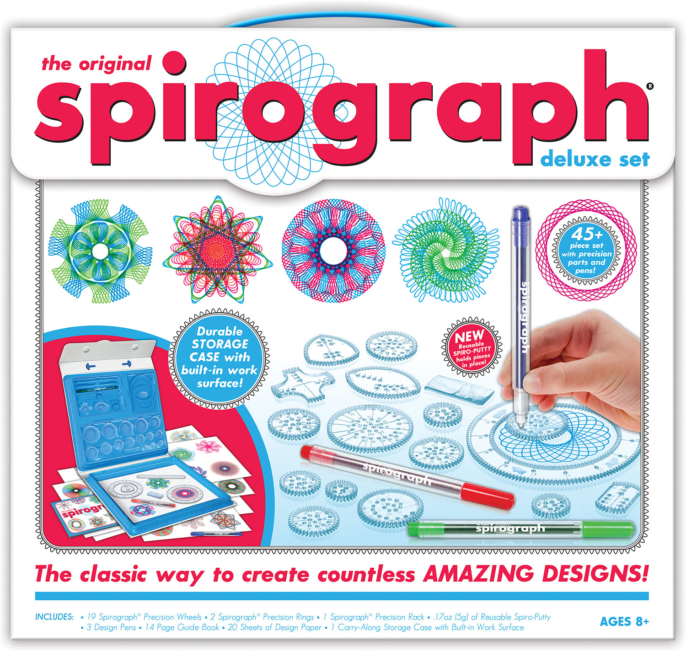

# spirograph-wasm

Math is cool. Art is cool. Spirograph = math + art.

I built this to explore Rust + WASM.

To build `wasm-pack build --target web` to serve: `python3 -m http.server 8000`.

## Reference material:

On WASM:

- https://rustwasm.github.io/docs/book/
- https://www.youtube.com/watch?v=qQMc3C1tJgw
  On spirographs:
- https://www.eddaardvark.co.uk/python_patterns/spirograph.html
